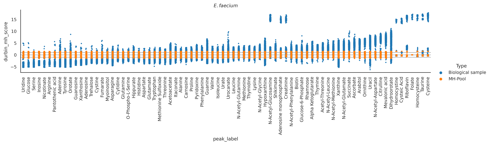

[](https://github.com/LewisResearchGroup/lrg-omics/actions/workflows/pytest.yml)
[](https://www.python.org/)

[](https://lsarp.github.io/lrg-omics/?badge=stable)

# LRG codebase for omics integration 

Lewis Research Group (LRG) codebase for omics data generation, processing, quality control and integration. 


 [Documentation](https://LSARP.github.io/lrg-omics/)


##  Download and install from source

    git clone git@github.com:LewisResearchGroup/lrg-omics.git
    cd lrg-omics
    conda env create -f dev/conda/environment.yml
    conda activate lrg
    pip install -e .


## Install LRG kernel in JupyterLab

    ipython kernel install --name "LRG" --user


## Authors

- Soren Wacker
- Mario Ernesto-Valdés
- Luis Ponce Alvares
- Estefania Barreto-Ojeda (@ojeda-e)

# Release notes

- Support for Python 3.6 and 3.7 was dropped.


# Scripts

## lrg_run_maxquant.py

A script to run MaxQuant runs from the Linux command line. The script can be used to on SLURM HPC clusters to create and submit jobs. The job is executed in the temporary directory `--run-dir` and then the only the results are copied to the output directory `--out-dir`. By default a unique id is added to the rundir name and the run is executed in a subdirectory of `--run-dir` which is the name of the .RAW file that is going to be processed. This way many files can be processed with the same settings without confusing the results. One limitation of the script is that it expects exactly one .RAW file per run. It is not tested for multiple .RAW files at once. If you have installed MaxQuant with `conda`, the you can use `--maxquantcmd maxquant`. You can run any version of MaxQuant using `mono`. In that case the command loosk like `--maxquantcmd "mono /path/to/MaxQuantCmd.exe". Note that, not every `mono` version works with every `MaxQuant` version.

```
usage: lrg_run_maxquant.py [-h] --raw [RAW ...] --fasta FASTA --mqpar MQPAR [--run-dir RUN_DIR] [--out-dir OUT_DIR] [--cold-run] [--rerun] [--submit] [--batch-cmd BATCH_CMD] --maxquantcmd MAXQUANTCMD [--add-raw-name-to-outdir]
                           [--add-uuid-to-rundir] [--cleanup] [--verbose]

Process MaxQuant runs.

options:
  -h, --help            show this help message and exit
  --raw [RAW ...]       RAW files to process.
  --fasta FASTA         Fasta file.
  --mqpar MQPAR         MaxQuant parameter template file (mqpar.xml).
  --run-dir RUN_DIR     Temporary directory to perform the calculation.
  --out-dir OUT_DIR     Location of the final results.
  --cold-run            Just simulate run and show the actions.
  --rerun               Start the run even if results already exist.
  --submit              Submit slurm job.
  --batch-cmd BATCH_CMD
                        Additional commands for slum job script e.g. "source .bashrc conda activate omics;...".
  --maxquantcmd MAXQUANTCMD
                        Command to start MaxQuant e.g. "mono MaxQuantCmd.exe".
  --add-raw-name-to-outdir
                        Do not add subdirectory raw file name to run directory.
  --add-uuid-to-rundir  Do not add uuid to run directory.
  --cleanup             Remove run directory after running MaxQuant
  --verbose
```


## lrg_mzML2mzMLb.py

A script that can be used to convert metabolomics `mzML` files to `mzMLb` format. The script uses the `psims` library.

```
usage: lrg_mzML2mzMLb.py [-h] [-i INPUT] [-o OUTPUT] [-d OUTPUT_DIRECTORY]

options:
  -h, --help            show this help message and exit
  -i INPUT, --input INPUT
  -o OUTPUT, --output OUTPUT
  -d OUTPUT_DIRECTORY, --output-directory OUTPUT_DIRECTORY
```

## lrg_thermo_worklist_parser.py

Command line tool to extract data from ThermoFisher instrument worklists.

```
Usage: cat [OPTION]... [FILE]...
Concatenate FILE(s) to standard output.

With no FILE, or when FILE is -, read standard input.

  -A, --show-all           equivalent to -vET
  -b, --number-nonblank    number nonempty output lines, overrides -n
  -e                       equivalent to -vE
  -E, --show-ends          display $ at end of each line
  -n, --number             number all output lines
  -s, --squeeze-blank      suppress repeated empty output lines
  -t                       equivalent to -vT
  -T, --show-tabs          display TAB characters as ^I
  -u                       (ignored)
  -v, --show-nonprinting   use ^ and M- notation, except for LFD and TAB
      --help     display this help and exit
      --version  output version information and exit

Examples:
  cat f - g  Output f's contents, then standard input, then g's contents.
  cat        Copy standard input to standard output.

```

## Metabolomics

### Eat-o-gram
    from lrg_omics.metabolomics.Eatogram import Eatogram
    eatogram = Eatogram('input/230420-MINT__LSARP-FAES__results.csv',  # MINT results table
                        'input/230420-MINT__LSARP-FAES__metadata.csv', # MINT metadata table
                        'E. faecium')
    eatogram.run()
    plt.title('$E. faecium$')
    
    
    


